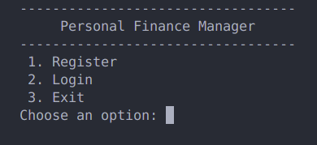
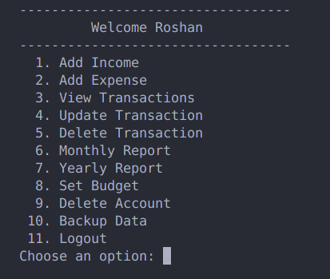
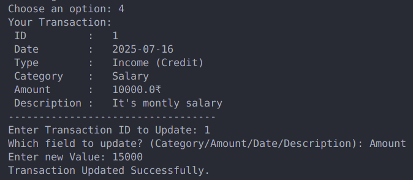
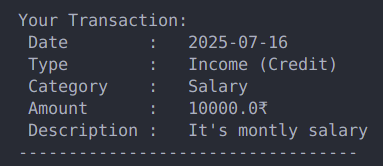

# Personal Finance Manager (CLI)

A Python command-line application to help you **track income & expenses**, **set budgets**, and **generate monthly/yearly reports**. Built with a focus on simplicity, reliability, and maintainable code.

---

## Table of Contents

- [Overview](#overview)  
- [Features](#features)  
- [Tech Stack](#tech-stack)  
- [Project Structure](#project-structure)  
- [Getting Started](#getting-started)  
- [Usage](#usage)
- [Project Output & Screenshots](#project-output--screenshots)  
- [Testing](#testing)
- [Contributing](#contributing)  
- [License](#license)
- [Developer](#developer-info)

---

## Overview

It's a CLI tool that lets users register/login, record transactions with categories (e.g., Food, Rent, Salary), set monthly category budgets, and generate monthly/yearly reports showing totals and savings. Data is stored locally (e.g., SQLite).

---

## Features

- **User Registration & Authentication**
- **Income & Expense Tracking**
- **Financial Reports**
- **Budgeting**
- **Data Persistence**
- **Testing & Documentation**

---

## Tech Stack

- **Language:** Python  
- **Database:** SQLite  
- **Interface:** Command Line (CLI)

---

## Project Structure

```txt
personal-finance-manager/
├─ pfm/
│  ├─ cli.py
│  ├─ auth.py
│  ├─ models.py
│  ├─ services/
│  ├─ db.py
│  └─ utils.py
├─ tests/
├─ assets/screenshots/
├─ requirements.txt
├─ README.md
└─ LICENSE
```

---

## Getting Started
## Clone the project.
```bash
git clone https://github.com/your-username/personal-finance-manager.git
cd personal-finance-manager
```

## Activate the Virtual Environment.
```
python -m venv .venv
source .venv/bin/activate
```

## Install Required Package
```
pip install -r requirements.txt
python -m pfm.cli init-db
```

---

## Usage

- Create account
- Log in with your account
- Perform all banking processes
- Track all your finances
- Take a backup (If you want)
- Delete account (If you want)
- logout.
  

---

## Project Output & Screenshots

### Login and Registration


### All Featucher


### Transaction & Update


### View Transaction


---

## Testing

```bash
pytest -q
```

Test modules for:
- Registration & login  
- Transaction operations  
- Budget checks  
- Reports

---

## Contributing

1. Fork the repo  
2. Create a branch: `git checkout -b feat/feature-name`  
3. Push and PR

---

## License

This project is licensed under the MIT License. Please take a look at the [LICENSE](License.md) file for details.

The [README](Readme.md) file is structured to provide a comprehensive overview of the project, instructions for running it, and potential areas for improvement.

---

## Developer Info
### Roshan Sharma | Software Engineer 
- **GitHub**: [RoshanSharma7](https://github.com/RoshanSharma7)
- **LinkedIn**: [RoshanSharma7](https://www.linkedin.com/in/roshan-sharma7)
- **Instagram**: [iamroshansharma7](https://www.instagram.com/iamroshansharma7/)
- **Email**: roshan.amlai96@gmail.com

Follow me on all Social Media platforms for better communication.
